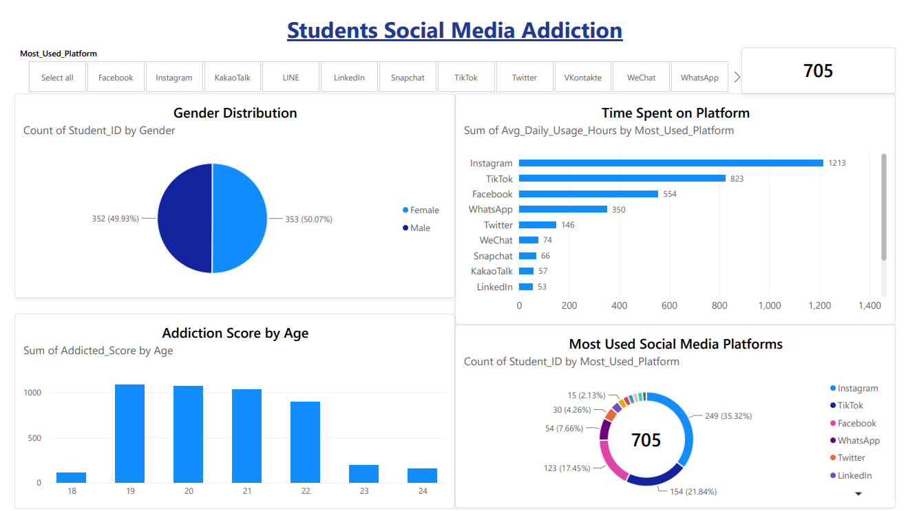

# Social Media Addiction Dashboard (Power BI)

An interactive Power BI report analyzing social media usage behavior and addiction scores across platforms, demographics, and time spent.

## 📊 Overview
This dashboard examines how usage patterns (time spent, platform choice) relate to addiction scores across different age groups and genders.

## Key Visuals
- **Time Spent on Platform** – average hours per day by platform
- **Gender Distribution** – breakdown of users by gender
- **Addiction Score by Age** – average addiction score across age groups
- **Most Used Social Media Platforms** – platform popularity ranking

